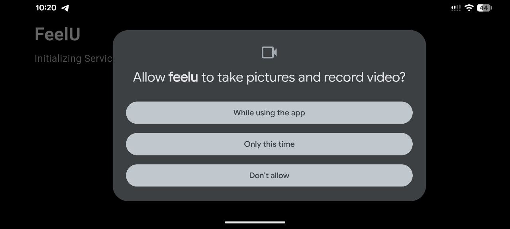

## Requirements

1. **Android phone with Android 14 or newer**
2. **A phone with a vibration motor that supports different vibration strengths**
   - Check your phone specifications (on the manufacturer website).
3. **Vibration must be ON**
   - Video guide: [https://youtu.be/q8oQrmOyZ1A?t=69](https://youtu.be/q8oQrmOyZ1A?t=69)
4. **At least 4 GB free storage**
   - The app downloads an AI model (Gemma-3n) to your phone. The download size is about **4 GB**.
5. **Initial internet connection for model download**

## Setup

1. **Download and install the latest app release (APK)**
   - Download link: [https://github.com/nullhtp/feelu/releases/download/v0.0.1-poc/app-release.apk](https://github.com/nullhtp/feelu/releases/download/v0.0.1-poc/app-release.apk)
2. **Open the app**
3. **Allow permissions**
   - The app will ask for **Camera** and **Microphone** permissions during the first start.
   - Tap **Allow** for both.
   - 
4. **Wait for the model download**
   - The app will download an AI model (~**8 GB**) to your phone.
   - This can take some time, depending on your internet speed.

After setup is finished, open the file [USER_GUIDE.md](./USER_GUIDE.md) and follow the instructions inside.
