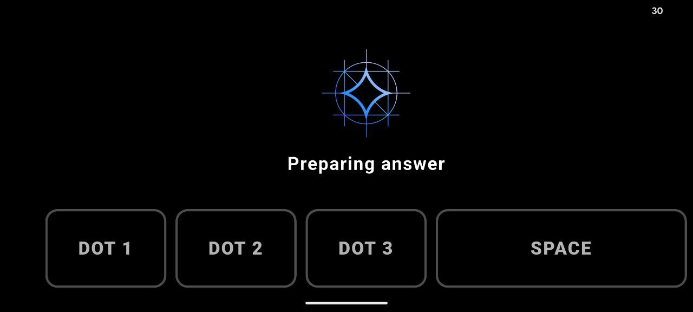
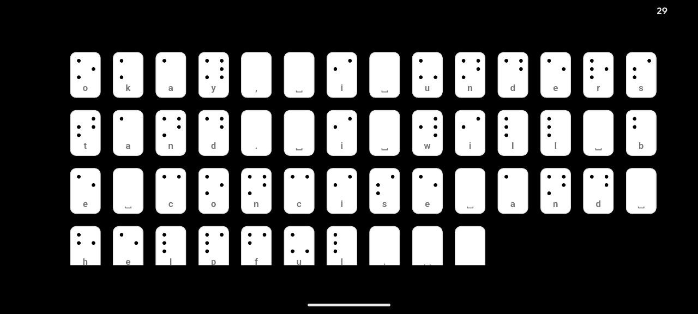

# FeelU User Guide

## 1. What is FeelU?

FeelU is an Android app for **deaf-blind individuals**. It helps you communicate with the world. It uses vibrations, a camera, and voice tools to help you read and write using Braille.

**Main Features:**

- **Braille Keyboard:** A piano-style keyboard to type Braille.
- **Vibration (Haptic) Feedback:** The phone vibrates to let you feel buttons and text.
- **Smart Camera:** Takes photos and describes objects to you using voice and vibration.
- **Voice Mode:** Listens to speech and turns it into text/vibration.
- **AI Assistant:** A smart helper you can ask questions.

---

## 2. Main Features Guide

### A. Braille Input Screen (Home Screen)

This is the main screen. You start here.

**Screen Layout:**

- **Top Part (2/3):** Shows the text you type.
- **Bottom Part (1/3):** The Piano Keyboard for typing.

**How the Keyboard Works:**

- **3 Main Keys:** These represent the left side of a Braille cell (Dots 1, 2, and 3).
- **Space Key:** Use this for empty spots (no dots).

**How to Type a Braille Character:**

1. **Step 1 (First Half):** Press the keys for the _left_ side of the Braille character. The phone will vibrate heavily.
2. **Step 2 (Second Half):** Press the keys for the _right_ side of the Braille character.
3. **Result:** The app combines both steps to make one full Braille letter.

**Navigation Gestures (Use 3 Fingers):**
Swipe on the **top part** of the screen.

| Action           | Result                                                       |
| ---------------- | ------------------------------------------------------------ |
| **Swipe Left**   | Go to **Camera** (Photo Vibro)                               |
| **Swipe Right**  | Go to **Voice** (Speech Vibro)                               |
| **Swipe Up**     | Ask the **AI Assistant** (write a question first)            |
| **Swipe Down**   | **Read Text** (Turn your written text into speech/vibration) |
| **1-Finger Tap** | Delete the last letter                                       |

---

### B. Photo Vibro Screen (Camera)

Take a picture to find out what is in front of you.

**How to use:**

1. **Swipe Left** from the Home Screen to get here.
2. **Tap anywhere** on the screen to take a photo.
3. **Wait.** The app needs time to think (about 15 seconds).
4. The app will describe the objects in the photo using Braille vibration.

**Screen Status:**

- **"Tap to see"**: Ready to take a photo.
- **"Capturing..."**: Taking the photo now.
- **"Describing..."**: The AI is thinking.

> **To go back:** Swipe **Right** with 3 fingers.

---

### C. Speech Vibro Screen (Voice Mode)

The app listens to people talking and turns it into text for you.

**How to use:**

1. **Swipe Right** from the Home Screen to get here.
2. **Tap the screen** to start listening.
3. The app will:

- Listen to speech.
- Summarize it (make the text shorter).
- Turn the text into Braille vibration.

**Note:** The app stops listening if there is silence for 3 seconds.

> **To go back:** Swipe **Left** with 3 fingers.

---

### D. AI Assistant

You can ask the app for help or general questions.

1. Type your question on the main screen.
2. **Swipe Up** with 3 fingers.
3. The Assistant will answer you using vibration.

---

### E. Braille Fullscreen Mode (Reading Mode)

This screen appears when the app wants you to "read" text with your fingers. You can learn more about how this works [here](https://www.google.com/search?q=VIBRO_BRAILLE_GUIDE.md).

**How to read:**

- **Touch:** Tap a dot to feel its vibration pattern.
- **Slide:** Drag your finger across the dots to read continuously.
- **Wait Time:** There is a short delay (0.15 seconds) between vibrations so the letters do not mix together.

> **To go back:** Swipe **Down** with 3 fingers.

---

## 3. Privacy and AI

- **Offline:** The AI works on your phone. It does **not** need the internet after you set it up.
- **Private:** Your photos and voice data stay on your phone. They are not sent to any servers.
- **Summarization:** If a text is very long, the AI will make it shorter so it is faster to read.

---

## 4. Troubleshooting (Fixing Problems)

### App Won't Start

- Did you download the AI models? (You might need a Hugging Face token).
- Did you give permission for the Camera, Microphone, and Vibration?
- Try closing the app and opening it again.

### Braille Typing Is Not Working

- Press the keys harder.
- Wait for the vibration after the "First Half" before pressing the "Second Half."
- Delete the text and try again.

### Voice/Speech Is Not Working

- Speak clearly.
- Make sure the room is not too noisy.
- Wait for 3 seconds of silence so the app knows you are finished speaking.

### No Vibration

- Check your Android settings. Is "Vibration" turned on?
- Check Accessibility settings.

### Need Help?

- Use the **AI Assistant** (Swipe Up with 3 fingers) to ask for help inside the app.
