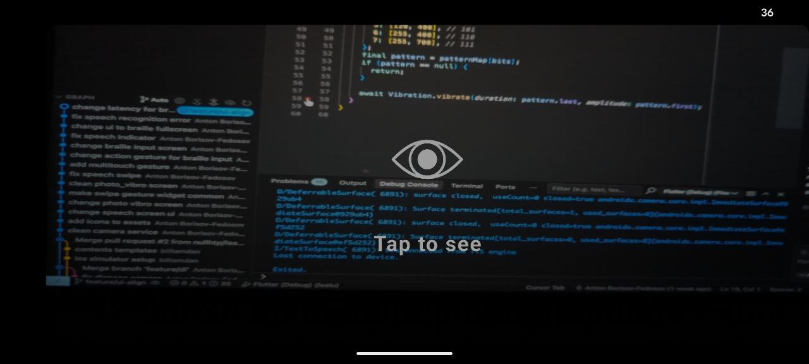

# User Guide

## Overview

FeelU is an Android application specifically designed to help deaf-blind individuals communicate with the outside world through innovative Braille-vibration feedback, AI-powered image recognition, speech processing, and Braille input systems.

## Key Features

- **Braille Input System**: Interactive piano-style keyboard for Braille character input
- **Haptic Feedback**: Vibration patterns for different types of feedback and Braille character output
- **AI-Powered Image Recognition**: Camera-based object identification with voice descriptions
- **Speech Recognition & Synthesis**: Voice input/output capabilities
- **AI Assistant**: Personal assistant for questions and help
- **Multi-finger Gesture Navigation**: Accessible navigation between app features
- **Braille Text System**: Interface for reading text in Braille format through touch and vibration

## Getting Started

### First Launch
1. When you first open FeelU, the app will automatically initialize all required services
2. You'll see an initialization screen that sets up:
   - Speech recognition and text-to-speech services
   - AI models for image recognition and text processing
   - Camera services
   - Vibration feedback systems
3. Wait for all services to initialize successfully (indicated by completion sounds and vibrations)
4. The app will automatically navigate to the main Braille Input screen

### Device Orientation
- FeelU is designed to work in landscape mode only
- The device will automatically lock to landscape orientation when the app starts
- The app keeps your screen awake to prevent interruptions during use

## Main Features Guide

### 1. Braille Input Screen (Main Hub)

This is the central screen where you can input text using Braille and navigate to other features.

#### Layout:
- **Top Area (2/3 of screen)**: Display area showing current text and status
- **Bottom Area (1/3 of screen)**: Braille piano keyboard

#### Braille Piano Keyboard:
- **3 Main Keys**: Represent the left column of a Braille cell (dots 1, 2, 3)
- **Space Key**: Represents empty input (dots 4, 5, 6 set to zero)

#### How to Input Braille:

1. **First Half**: Press combination of the 3 main keys or space for the first half of the Braille character
2. **Second Half**: Press combination of the 3 main keys or space for the second half of the Braille character
3. The app automatically combines both halves to form a complete Braille character
4. Characters are converted to text and displayed on screen
5. Use the gesture to process your complete text

#### Haptic Feedback:
- Heavy vibration when you press the first half of a character
- Different vibration patterns indicate successful character recognition
- Error patterns for invalid input

#### Navigation Gestures (3-finger swipes on top area):
- **Swipe Left**: Go to Photo Vibro (Camera) screen
- **Swipe Right**: Go to Speech Vibro (Voice) screen  
- **Swipe Up**: Ask the AI Assistant a question
- **Swipe Down**: Text to speak generation

### 2. Photo Vibro Screen (Camera Mode)

This feature allows you to take photos and receive AI-generated descriptions of what's in the image.

#### How to Use:
1. Navigate here by **3-finger swipe left** from the main screen
2. **Tap anywhere** on the screen to capture a photo
3. The app will:
   - Take a photo using the rear camera
   - Process the image with AI recognition
   - Provide a Braille-vibration output of objects in the image

#### Screen States:
- **Ready**: "Tap to see" - ready to take a photo
- **Capturing**: "Capturing..." - taking the photo
- **Processing**: "Describing..." - AI is analyzing the image

#### Navigation:
- **3-finger swipe right**: Return to Braille Input screen

### 3. Speech Vibro Screen (Voice Mode)

This feature enables speech recognition and converts spoken words into text with haptic feedback.

#### How to Use:
1. Navigate here by **3-finger swipe right** from the main screen
2. Tap to starts listening for speech
3. The app will:
   - Recognize speech around you and convert it to text
   - Summarized version of what it heard
   - Convert summarized text to Braille vibration

#### Speech Processing:
- Continuous listening with 3-second silence detection
- Automatic text summarization for long speech
- Braille vibration feedback of recognized and processed text

#### Navigation:
- **3-finger swipe left**: Return to Braille Input screen

### 4. AI Assistant

Access the AI assistant for questions and help.

#### How to Use:
1. Ask questions using Braille input
2. **3-finger swipe up** from the main Braille screen
3. The assistant provides concise, helpful responses
4. Responses are delivered through Braille-vibration output

### 5. Braille Fullscreen Mode

This feature provides a dedicated fullscreen interface for reading text in Braille format through touch and vibration.

#### How to Access:
- Automatically opens when the AI Assistant provides responses
- Displays AI-generated text in visual Braille format with tactile feedback
- Optimized for touch-based Braille reading

#### How to Use:
1. **Touch Reading**: Tap on individual Braille characters to feel their vibration pattern
2. **Slide Reading**: Drag your finger across characters to read continuously
3. **Character Recognition**: Each character vibrates its unique Braille pattern when touched
4. **Cooldown System**: 150ms delay between character vibrations to prevent overlap

#### Navigation:
- **3-finger swipe down**: Return to previous screen

#### Touch Interface:
- **Pan Gesture**: Slide finger to read multiple characters in sequence
- **Tap Gesture**: Touch individual characters for precise reading
- **Vibration Feedback**: Each character produces its unique Braille vibration pattern
- **Position Detection**: Automatically detects which character you're touching

## AI Features

### Image Recognition:
- Identifies objects in photos
- Provides concise descriptions (10 words or less)
- Returns "Empty" if no clear objects are detected
- Processes images locally using Gemma AI model

### Text Processing:
- **Summarization**: Condenses long text into brief summaries
- **Decoding**: Interprets and clarifies unclear text
- **Assistant**: Answers questions and provides help

### Privacy:
- All AI processing happens locally on your device
- No data is sent to external servers
- Requires one-time download of AI models

## Troubleshooting

### Common Issues:

#### App Won't Start:
- Ensure AI models are downloaded (requires Hugging Face token)
- Check that all permissions are granted (camera, microphone, vibration)
- Restart the app and wait for complete initialization

#### Braille Input Not Working:
- Ensure you're pressing keys firmly
- Wait for haptic feedback before pressing the second half
- Try clearing current input and starting fresh

#### Speech Recognition Issues:
- Speak clearly and at moderate pace
- Ensure microphone permissions are granted
- Check for background noise interference
- Wait 3 seconds of silence to complete recognition

#### Camera Not Responding:
- Grant camera permissions in device settings
- Ensure rear camera is not blocked
- Good lighting improves recognition accuracy

#### No Vibration:
- Check device vibration settings
- Ensure vibration is enabled in accessibility settings
- Some devices may have limited vibration capabilities

### Getting Help:
- Use the AI Assistant (3-finger swipe up) for quick help
- Check that all device permissions are properly granted
- Restart the app if services fail to initialize

## Technical Requirements

### Device Requirements:
- Android device with camera
- Microphone capabilities
- Vibration motor with amplitude modulation
- Sufficient storage for AI models (~2-4 GB)
- Internet connection for initial model download

### Permissions Required:
- Camera access
- Microphone access
- Vibration control
- Wake lock (keep screen on)
- Storage access for AI models

### Setup Requirements:
- Initial internet connection for model download
- Complete app initialization before use
