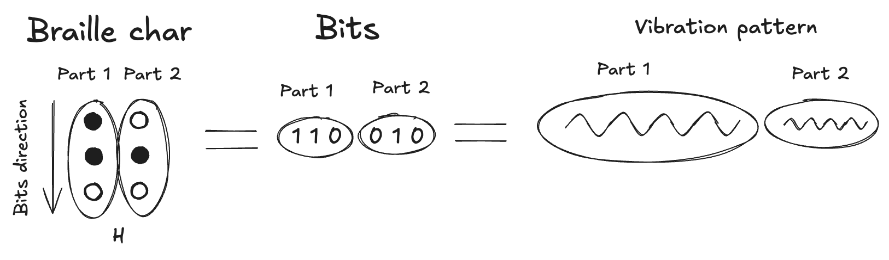

# Vibro-Braille: New Way of Communication for Deaf-Blind Individuals

## Core Concept

Vibro-Braille is an innovative haptic communication system that translates traditional Braille characters into precise vibration patterns, enabling deaf-blind individuals to "feel" text through their smartphone's vibration motor. This groundbreaking technology transforms any modern mobile device into a portable Braille reader, making digital information accessible without requiring expensive specialized hardware.

## How Vibro-Braille Works

### 1. Braille to Vibration Translation

Traditional Braille uses a 6-dot cell system arranged in two columns of three dots each:
```
1 • • 4
2 • • 5  
3 • • 6
```

In Vibro-Braille, each dot position is represented by binary code (1 = raised dot, 0 = empty space), creating a 6-bit pattern for every character. For example:
- Letter 'A' = `100000` (only dot 1 is raised)
- Letter 'B' = `110000` (dots 1 and 2 are raised)
- Letter 'C' = `100100` (dots 1 and 4 are raised)

### 2. Dual-Phase Vibration System



Each Braille character is transmitted through a sophisticated two-phase vibration sequence:

**Phase 1: First Half (Dots 1, 2, 3)**
- The first three bits control the initial vibration pattern
- Different combinations create distinct vibration intensities and durations

**Phase 2: Second Half (Dots 4, 5, 6)**
- After a 200ms pause, the remaining three bits are transmitted
- This creates a recognizable rhythm that the user learns to interpret

### 3. Vibration Pattern Mapping

Each 3-bit combination maps to specific vibration characteristics:

| Binary Pattern | Intensity | Duration | Description |
|----------------|-----------|----------|-------------|
| `000` | Light haptic | N/A | Empty dots (tactile tap) |
| `001` | 40/255 | 200ms | Single dot pattern |
| `010` | 120/255 | 200ms | Medium single dot |
| `011` | 255/255 | 200ms | Strong double dot |
| `100` | 40/255 | 400ms | Extended single dot |
| `101` | 120/255 | 400ms | Extended medium dot |
| `110` | 255/255 | 400ms | Extended strong double |
| `111` | 255/255 | 700ms | Maximum intensity triple |

## Helping Deaf-Blind Individuals

### 1. Breaking Communication Barriers

**Real-World Integration**: The system works with live camera feeds and speech recognition, allowing users to:
- "Read" objects and text captured by their phone's camera
- Receive spoken conversations converted to Braille vibrations
- Interact with AI assistants through Braille input and output

### 2. Independence and Mobility

**Portable Solution**: Instead of carrying bulky, expensive Braille devices, users need only their smartphone, making the technology:
- Highly portable and discreet
- Always available when needed
- Cost-effective compared to traditional assistive technology

**Real-Time Communication**: The system enables immediate translation of various inputs:
- Environmental audio → Speech recognition → Braille vibration
- Visual scenes → AI image recognition → Braille vibration
- User questions → AI responses → Braille vibration

## Impact on Daily Life

### 1. Professional Integration

Working professionals can:
- Read emails and documents during meetings
- Access work-related information discretely

### 2. Social Connection

Social interaction becomes more natural through:
- Text message conversations with friends and family
- Social media content consumption

### 3. Emergency and Safety

Critical for emergency situations:
- Reading emergency alerts and notifications
- Accessing important information during crises
- Maintaining communication when other methods fail

## Future Possibilities

### 1. Enhanced Patterns

- Development of more nuanced vibration patterns for punctuation and formatting
- Integration of musical rhythm patterns for more intuitive learning
- Support for multiple languages and Braille variants

### 2. Community Features

- Sharing custom vibration patterns between users
- Community-driven improvements to recognition accuracy
- Collaborative development of new use cases

### 3. Hardware Evolution

- Integration with wearable devices for even more discreet use
- Improved haptic motors for more precise feedback
- Multi-point vibration systems for faster reading

## Conclusion

Vibro-Braille represents a paradigm shift in assistive technology, transforming everyday smartphones into powerful communication tools for deaf-blind individuals. By leveraging the ubiquity of mobile devices and the precision of modern haptic systems, this technology democratizes access to digital information and significantly enhances independence, communication, and quality of life.

The system's elegance lies in its simplicity: using familiar Braille patterns translated into carefully crafted vibration sequences, users can maintain their existing tactile reading skills while gaining access to an entirely new world of digital communication and information access.

Through continuous refinement and community feedback, Vibro-Braille has the potential to become the standard method for haptic text communication, opening doors to education, employment, and social participation that were previously challenging or impossible to access.
